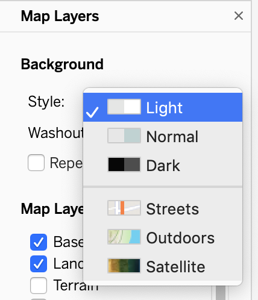
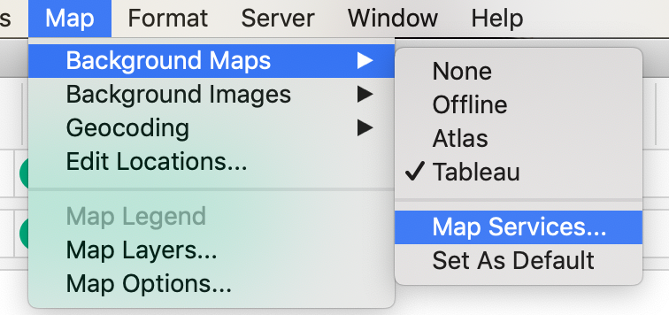
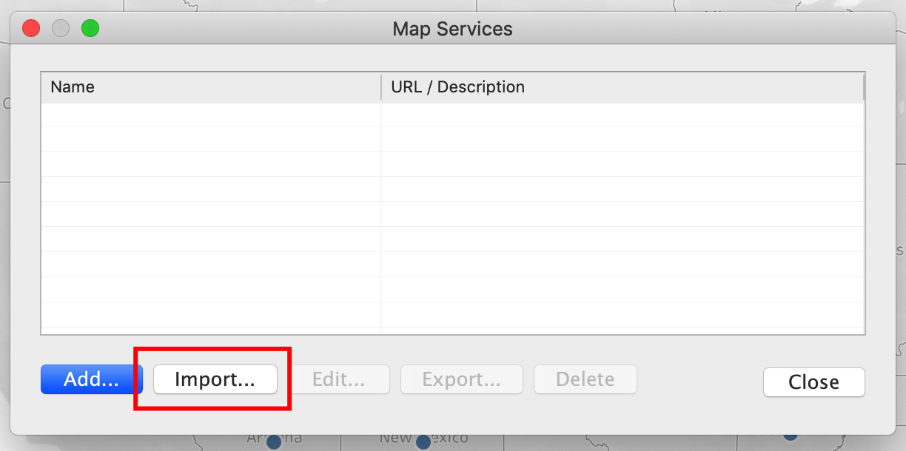
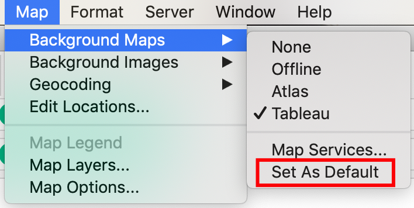

# Tableau + Atlas Configuration CLI

There are common cases where your Tableau Desktop and Server installations have difficulty in accessing the open internet. This can block or impede access to Mapbox, which can cause lag (or errors) in rendering maps in Tableau.

In these cases, [Mapbox Atlas](https://www.mapbox.com/atlas/) is a solution for providing the same vector maps within your own IT environment.

When using Mapbox Atlas (or the Tableau maps proxy), configuration requires [hand-editing of TMS files](https://community.tableau.com/docs/DOC-10159). This process is error-prone and when successful, hard to distribute to Desktop users. This is due to Tableau Desktop needing a `mapbox.com` URL.

The **Tableau + Atlas Configuration CLI** or `tabAtlas` automates this process using the same user workflow as a custom style. When it completes, the Tableau user will have a valid TMS placed in their Tableau repository. Upon opening Tableau Desktop (or Tableau Server web-editing), they will have the option to switch to the Atlas-based map style and select it as default for future workbooks.

The CLI is intended for both Desktop users and Server Administrators. Desktop users can use the tool a single time and set the new map source as a default. Server Administrators can use the tool to create a single authoritative TMS to distribute via wikis, fileshares, or their own distributed packaged installer as well as place on Server for web-editing use.

## Usage

There CLI can be downloaded for both Mac and Windows via `Releases`.

- Windows: `tableauAtlasCofig-win.exe`
- Mac: `tableauAtlasConfig-macos`
- Linux: `tableauAtlasConfig-linux`

It is also available via the [Atlas Toolkit](https://blog.mapbox.com/no-code-data-visualization-and-analysis-on-closed-networks-ec4bb8c913ff), which is included in the standard distribution of Atlas.

### Cross-platform instructions

The tool accepts a single command `generate`, with a single option `-n` that accepts an integer.

This indicates the number of styles you want to combine into a single TMS.

You will be first prompted for the location of your Tableau Repository. The CLI will auto-detect your operating system and suggest a default path for saving. You can choose this option or provide your own fully qualified path.

If you do not know where your Repository is, or have trouble finding it in your filesystem:

- For Windows, this is usually found in `My Documents`.
- For Mac, this is typically found in `Documents`.

Example:

```bash
/Users/christoomey/Documents/My Tableau Repository
```


You can also specify the `Beta` version of your Repository if you want to test with Tableau Desktop betas.

- Style: This is the same URL you would use to add a custom style in Tableau today. You can find these from the `Share` menu in Mapbox Studio

```url
https://api.mapbox.com/styles/v1/mbxsolutions/ck2mcwoz10bj31cqrxs781qmk.html?title=true&access_token=pk.eyJ1IjoibWJ4c29sdXRpb25zIiwiYSI6ImNrMm5uZWZpdjAzdTQzZ210eXJ1dnM3dnkifQ.hLiRMezDCPS1SgGUC1KJsQ#9.0/37.780000/-122.424100/0
```

- Name: These are what appear in your Layers list in the `Map Layers` dropdown menu.



The CLI will try to validate the URL inputs and will show errors in the terminal if the URL is invalid.
  
### Windows

1. Double-click on the `exe`
2. This will show you a terminal with `atlasConfig$`
3. Type `generate` and follow the instructions [above](#cross-platform)

### Mac/Linux

Run the executable with the following

```bash
./tableauAtlasConfig-macos
```

## Update Tableau Defaults

Once the CLI runs, you will see `Atlas.tms` in your Tableau Repository. To import and set this new file as your new default, follow these steps:

1. Open Tableau Desktop.
2. Go to Map > Background Maps > Map Services.

3. In Map Services box, select `Import`.

4. Select `Atlas.tms`.
5. Validate that your new map appears.
6. If you see a map, set this as a default via Map > Background Maps > Set as Default.

7. Restart Tableau and create a map.

## HTTP/HTTPS

While it is possible to deploy Atlas without HTTPS, Tableau does not support mapping services via `http`. For more information about Atlas configuration, read the [Atlas documentation](https://docs.mapbox.com/atlas/overview/).

### Certificates

It is possible to deploy HTTPS-enabled Atlas with a self-signed certificate. If this is your chosen deployment, you will have to configure the trust relationship between your Desktop users' machines and your certificate. Contact your system administrator to configure this trust.

If you have administrative rights on your machine, you can configure this using the following process (we recommend contacting your system administrator):

- [Mac](https://tosbourn.com/getting-os-x-to-trust-self-signed-ssl-certificates/)
- [Windows](https://docs.microsoft.com/en-us/dotnet/framework/wcf/feature-details/working-with-certificates)

## Support

This tool is provided as-is by Mapbox. If you find fundamental issues with this tool, file an issue in this repository. Feature requests and upgrade will be considered on a case-by-case basis.

**Tableau will not provide support for this tool.**

## Development

If you wish to develop or upgrade this tool on your own, the uncompiled source is contained in `src/index.js`.

To develop:

```bash
cd src
npm ci
```

As you edit, you can test by running `index.js`. This will start the CLI. Consult the documentation for the [core technology](#included-technologies) for instructions on their specific use.

When your work is complete, you can compile your binaries with `npm run build`.

### Included technologies

- CLI: [VorpalJS](https://github.com/dthree/vorpal)
- XML Parsing: [xml2js](https://github.com/Leonidas-from-XIV/node-xml2js)
- Packaging: [pkg](https://github.com/zeit/pkg)

## License

This project is licensed under the BSD-3-Clause License - see the [LICENSE.md](./LICENSE) file for details
